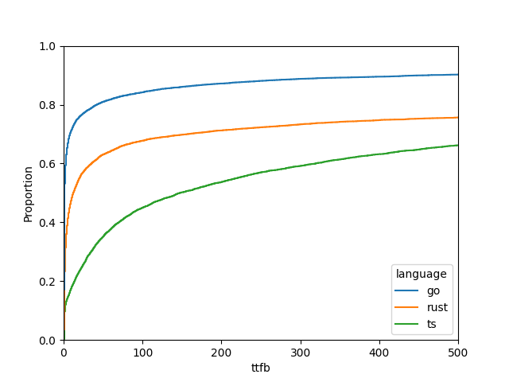
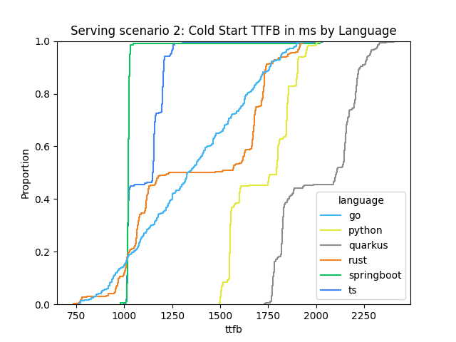
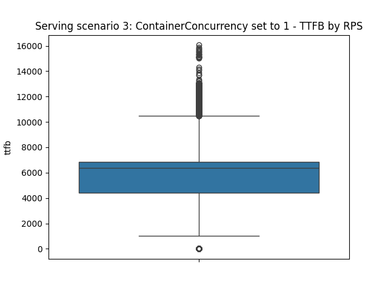

This benchmark was performed on a 6 node (5 workers and 1 control plane) kubernetes cluster running version 1.30.4.
Knative Serving version 1.17.0
Knative Eventing version 1.16.3
Node size : n2-standard-4 (4 vCPUs, 16GB RAM)
Node and pod metrics were collected using the metrics-server, they can be found in the benchmark.db database in the node_metrics and pod_metrics tables.
# Knative Serving
Knative serving provides a platform to deploy serverless workloads on top of kubernetes.
Users can define a Knative service, which contains a PodSpec.
When a service is created, it is originally scaled to zero, and then scaled up automatically based on demand.
Inside the deployment Pod, Knative controlls a sidecar container called "queue-proxy" which is responsible for routing requests to the container that contains the user's code.
This can also buffer requests according to the concurrency limit set in the service spec.

Autoscaling is achieved with a component called the "autoscaler", which talks to the kubernetes API.
The activator is a component that takes requests and proxies them to the Knative service.
https://knative.dev/docs/serving/request-flow/

The overall added value of Knative serving is that it abstracts the user from the underlying kubernetes resources, centralises configuration and simplifies the scaling process.
However, there is a trade-off in that the activator and autoscaler add overhead to the request path, and that Kubernetes itself is not designed for scale-to-zero. The mismatch between the two is discussed in https://arxiv.org/abs/2404.16393 .
Cold starts are a problem, as the first request after the service has been scaled to zero takes longer to execute: knative must first check if there is a running pod, if not, it must start one, and only after the pod has finished starting (Once it enters the ready state) the request is proxied to the pod.
This can be mitigated by keeping one running instance of the service at all times - which defeats the purpose of scale-to-zero.

The autoscaling strategy can be configured to be based on CPU usage or request concurrency by setting the "containerConcurrency" field in the service spec.
For example, it may be desirable to only process one request at a time for security reasons.
The side effect of this is that under heavy load, the kubernetes API can become a bottleneck to schedule new pods.

Developers can use Knative Functions to create serverless functions and deploy them as Knative services.

Knative maintains templates for many different languages and some frameworks. These functions can either consume http requests or cloud events.
The "func" CLI tool can be used to build, deploy and test these functions.
OCI images are automatically generated.

A first glance on the resulting image sizes shows that the tiniest images are for Go and Rust, which is expected as they are compiled languages.
The largest image is for Typescript, which uses [faas-js-runtime](https://www.npmjs.com/package/faas-js-runtime) ( a nodejs runtime for serverless functions ).
|Language  |Base Template Image Size|
|----------|------------------------|
|Go        |31.4 MB                 |
|Python    |94.4MB                  |
|Quarkus   |92.3 MB                 |
|Rust      |43.8 MB                 |
|Springboot|79.1 MB                 |
|Typescript|162 MB                  |

For single tenant scenarios where the number of different functions is limited, the image sizes should not be a problem, as they are usually cached in the node.
However, in a multi-tenant scenario, where the number of different functions is large, the image sizes could become a problem, as they are downloaded on-demand every time the revision is updated (for example when the function code is updated).

Overall, finding a sweet spot for RPS to send was a challenge: in many cases, the autoscaler would preemptively scale the services up to hundreds or even thousands of pods (even though a reduced number of them were actually needed, as they literally only immediately respond and perform no computation). This would then lead to a large number of 503 errors and sometimes made a node OOM kill the kubelet - rendering the node unusable until a restart.

The reason for the 503 error is an unconfigurable limit from Kourier (the ingress gateway). https://github.com/knative-extensions/net-kourier/issues/839

## Scenario 1
We analyse warm latency under heavy load by language and framework.
Runs with 25000 RPS  frequently caused a node OOM kill the kubelet - rendering the node unusable until a restart.
Runs with < 10000 RPS were stable.

### Under extreme load
- Go was the langugae  with the best ratio of status 200 46.42%
- Quarkus was the language with the worst ratio of status 200 2.42%

|language  |rps  |200               |408                |502 |503               |
|----------|-----|------------------|-------------------|----|------------------|
|go        |15000|100.0             |0.0                |0.0 |0.0               |
|go        |20000|39.21             |0.0                |0.0 |60.79             |
|go        |25000|46.42             |0.0                |0.0 |53.580000000000005|
|python    |15000|16.79             |0.0                |0.03|83.17999999999999 |
|python    |20000|3.34              |0.0                |0.0 |96.66             |
|python    |25000|7.17              |0.0                |0.0 |92.83             |
|quarkus   |15000|2.13              |0.0                |0.0 |97.87             |
|quarkus   |20000|4.279999999999999 |0.0                |0.0 |95.72             |
|quarkus   |25000|2.42              |0.0                |0.0 |97.58             |
|rust      |15000|41.27             |0.06               |0.0 |58.67             |
|rust      |20000|35.15             |0.06999999999999999|0.0 |64.77000000000001 |
|rust      |25000|20.76             |0.0                |0.0 |79.24             |
|springboot|15000|19.869999999999997|0.0                |0.0 |80.12             |
|springboot|20000|10.59             |0.0                |0.0 |89.41             |
|springboot|25000|12.280000000000001|0.0                |0.0 |87.72             |
|ts        |15000|26.44             |0.0                |0.0 |73.56             |
|ts        |20000|15.72             |0.0                |0.01|84.27             |
|ts        |25000|3.9600000000000004|0.0                |0.01|96.03             |

The 408 status code (Request Timeout) is caused by requests timing out after 30 seconds.

### Under high load
We had to leave out springboot, quarkus and python due to very frequent node crashes.
There was one successful run for quarkus at 10000 RPS.
All values are in percentage:
|language  |rps  |200               |408                |502 |503               |
|----------|-----|------------------|-------------------|----|------------------|
|go        |10000|97.65             |0.0                |0.0 |2.35              |
|go        |16000|93.8              |0.0                |0.0 |6.2               |
|python    |10000|86.56             |0.0                |0.0 |13.44             |
|quarkus   |10000|73.58             |0.0                |0.0 |26.419999999999998|
|rust      |10000|100.0             |0.0                |0.0 |0.0               |
|rust      |16000|91.97             |0.04               |0.01|7.9799999999999995|
|ts        |10000|95.08             |0.0                |0.09|4.83              |
|ts        |16000|93.95             |0.0                |0.01|6.04              |

The difference in this case might be that the compiled languages are just faster enough processing requests before the ingress gateway is saturated.
Due to JVM optimisations, both quarkus and springboot functions could handle more RPS once the process is warmed up, which is not usually the case in Knative - Functions are ephemeral and are scaled to zero after a period of inactivity.

Additionally, the autoscaler keeps trying to start more pods, but they stay in pending state for many seconds due to high contention on the node.
Under very high load, we see many 503 errors. Although the ingress gateway (kourier) is scaled to many replicas, most of the initial requests are rejected, due to the aforementioned limit.

The warm latency for successful requests is shown in the plot below (cold starts are not included).

As a table (all values in miliseconds):
|language  |rps  |Min|25% |Median|75%  |Max    |Std    |
|----------|-----|---|----|------|-----|-------|-------|
|go        |10000|0.0|1.0 |1.0   |1.0  |29995.0|873.87 |
|go        |16000|0.0|1.0 |1.0   |18.0 |29999.0|1399.44|
|rust      |10000|0.0|1.0 |1.0   |1.0  |1654.0 |15.78  |
|rust      |16000|0.0|2.0 |14.0  |482.0|31416.0|3244.56|
|ts        |10000|0.0|1.0 |4.0   |51.0 |29998.0|2884.7 |
|ts        |16000|0.0|22.0|143.0 |857.0|31634.0|3936.07|

We see that the median latency for go and rust is around 1ms for 10k RPS, and increases to around 14ms for 16k RPS for rust.
Overall it is a highly variant metric, and there are multiple causes for this:
- The ingress gateway being overloaded
- Resource contention on the node : Some pods can process requests faster, others slower.

DNS is managed by Kourier as well here, and it is configured to use an example.com domain, so there should be no DNS resolution issues.
However, we see that for some outilers, the DNS resolution time is as high as 6 seconds.

Dns resolution time per language and rps:
|language|rps  |Min|25%|Median|75%|Max   |Std   |
|--------|-----|---|---|------|---|------|------|
|go      |10000|0.0|0.0|0.0   |0.0|613.0 |6.43  |
|go      |16000|0.0|0.0|0.0   |0.0|6270.0|88.77 |
|rust    |10000|0.0|0.0|0.0   |0.0|34.0  |0.26  |
|rust    |16000|0.0|0.0|0.0   |0.0|2605.0|24.0  |
|ts      |10000|0.0|0.0|0.0   |0.0|145.0 |3.32  |
|ts      |16000|0.0|0.0|0.0   |0.0|5906.0|179.93|

#### Throughput
When sending 16k RPS, the median throughput caluculated over the whole experiment duration for Go is 11682.5 RPS, for Rust it is 11409.14 RPS and for Typescript it is 10633.3 RPS.
The main reason for the lower throughput is that the ingress gateway is saturated, and is rejecting requests with a 503 status code.

## Scenario 2
We analyse cold start latency by language and framework.
The "scale-to-zero-grace-period" is the amount of time the autoscaler will wait for a pod not recieving requests to be scaled down.
We set it to 10 seconds and we configured the workload-generator to send 1 request every minute to each endpoint, doing so sequentially in order to avoid contention between the services whilst booting up.

Cold start latency by language and framework (in ms):
|language  |Min   |25%    |Median|75%    |Max   |Std   |
|----------|------|-------|------|-------|------|------|
|go        |766.0 |1086.75|1332.5|1607.5 |1968.0|300.8 |
|python    |1497.0|1552.0 |1793.5|1850.0 |2021.0|157.93|
|quarkus   |1731.0|1822.0 |2107.0|2197.5 |2408.0|194.18|
|rust      |733.0 |1062.5 |1353.0|1690.0 |1968.0|347.55|
|springboot|979.0 |1018.0 |1021.0|1024.0 |2023.0|100.9 |
|ts        |998.0 |1018.0 |1148.5|1196.75|2033.0|114.05|

With a median cold start latency of 1021.0 ms (std 100.9) , the Springboot function is the fastest to start up, followed by Typescript (median 1148.5 ms, std 114.05) and Rust (median 1353.0 ms, std 347.55).
The Quarkus function has the highest cold start latency at a median of 2107.0 ms (std 194.18).
There is no correlation between image size and cold start latency, as the Typescript function has the largest image. 

Although the data does not present high variance in this case, it is surprising that compiled languages like Rust and Go have a higher cold start latency than Springboot and Typescript.

Overall a the cold start latency is a problem for any latency-sensitive workloads, especially for those who must set container concurrency to 1, which leads to many more cold starts.
Additionally, the latency is affected by the activator latency, who must request a scale up from the autoscaler, which by default uses the Knative Pod Autoscaler, which uses the Kubernetes API to scale the pods.
All of this added latency results in an overall mean cold start latency of 1434.626 ms.

## Scenario 3
We set container concurrency to 1 and analyse the impact on latency.
In this case, we only test the go language, as we are not interested in the language performance.
The function sleeps for 1 second after recieving a request, and then returns a 200 status code and a cold start flag, in order to simulate a 1 request per second throughput per pod. The function used for sleeping is time.Sleep(1 * time.Second).

We configured the Maximum amount of revisions to 400 and sent 400 RPS.
Each knative service deployment has a queue-proxy sidecar, which is a reverse proxy that handles the incoming requests.
It can also queue requests according to the concurrency limit set in the service spec (which is 1 in this case).
So what we expected to see is that all requests would be handled.

Values in ms:

Status code distribution by rps:
|rps       |200  |503|
|----------|-----|---|
|400       |76.25|23.75|

This results show that even with much lower RPS, the Kourier ingress gateway is denying 23.75% of requests with a 503 status code.

In the data, we observe high latency (median ~6744 ms): Despite the 1-second time.Sleep() per request, the latency values are significantly higher than expected.

Under the potential causes, we see that in Go, time.Sleep releases the Goroutine back to the runtime scheduler but does not yield the CPU directly. This means the thread may still incur some overhead if the scheduler has to frequently manage many sleeping threads.
If multiple containers or processes on the same node are calling time.Sleep at the same time, the kernel's scheduler might experience contention, leading to delays in accurately resuming threads after sleep.
Additionally, a 1-second delay per request might get compounded by additional overheads, including context switching, network I/O, or thread scheduling. The impact becomes visible in the higher percentiles (e.g., 75% and max latency).

In conclusion, the high latency likely results from a combination of system-level resource contention, thread scheduling delays, and potential Kubernetes overhead.
Reducing node-level contention or using more efficient delay mechanisms could improve performance.
The amount of nodes used in the cluster was a decision made mainly based on the amount of GCE credits we had.

# Conclusions

- Knative’s concurrency-based auto scaling tends to overprovision Pods for a given RPS, most likely due to extremely frequent readiness checks for cold start latency optimisation. This can be improved with appropriate configuration but requires more knowledge about the workload and shifts more responsibility to the user, going against the serverless approach.

- Open Issues in Kourier networking layer make it unfit to handle highly concurrent workloads.

- Cold start latency is greater than in typical FaaS platforms: https://www.usenix.org/conference/atc18/presentation/wang-liang , https://arxiv.org/abs/2012.14132 .

